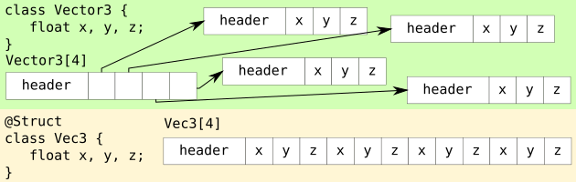
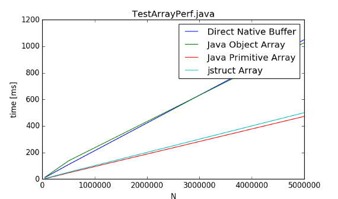

(More Information available at this project's [website](https://tehleo.github.io/junion/))
(Current version [1.2.1 (pre-release)](https://github.com/TehLeo/junion/releases))
# Project JUnion
[](https://gitter.im/JUnionChat/Lobby)
[](https://maven-badges.herokuapp.com/maven-central/com.github.tehleo/junion)



**Delivers struct types to Java programming language.** 

When creating arrays of int, we have two main options:
```java
int[] intArray = new int[1000];  
Integer[] intBoxedArray = new Integer[1000];
```
**How many bytes do** ```intArray, intBoxedArray``` **take to store 1000 ints?**

```intArray``` 4016 bytes ```4*1000 + ~16(around 16 bytes for array header)``` <br>
```intBoxedArray``` 20016 bytes ```(4 + ~12 + ~4)*1000 + ~16``` (exact number depends on VM)

**That is almost 5x more!** <br>
Well, this teaches us to prefer primitive arrays over their boxed versions. <br>
So what is this project about?

Consider
```java
class Point { float x,y;}
Point[] arr = new Point[500];
```
```arr``` takes 14016 bytes <br>
The data consits of 500 points, 2 floats each, thus 4000 bytes should be enough.<br>
If Point was a **struct**, ```arr``` would take ~4000 bytes.

Wouldn't it be nice to be able to create struct types in Java that code like class and work like structs?

With JUnion you can do just that by marking a class with @Struct annotation!

**Create struct Vec3:**

```java
@Struct
public class Vec3 {
    public float x,y,z;
}
```

**Afterwards you can use it as:**

```java
//Create a new struct array
Vec3[] arr = new Vec3[10];
arr[5].x = 10;
Vec3 v = arr[5];
...
//
ByteBuffer a = ByteBuffer.allocateDirect(10*Mem.sizeOf(Vec3.class))
   .order(ByteOrder.nativeOrder());
//Modify Direct Native Bytebuffer as it were a struct
Vec3[] arr = Mem.wrap(a);
arr[5].x = 10;
...
```

For a list of features [click here](https://tehleo.github.io/junion/features.html).

**Why use struct types?**

* Struct types use less memory.
* Have the performance of primitive types.
* Allow you to set data in direct native ByteBuffers with class-like syntax.

**Performance Test**



## Download

Check out the [latest release](https://github.com/TehLeo/junion/releases)

and usage/IDE integration [guide here.](https://tehleo.github.io/junion/install.html)

## Support & Donations

Would you like to support JUnion? You can report bugs or request for new features [here](https://github.com/TehLeo/junion/issues) or [chat here](https://gitter.im/JUnionChat/Lobby)

Or would you like to make a donation?
You can do so [via PayPap](https://www.paypal.me/JurajPapp)

## News & Info

Roadmap to JUnion 1.2.1 has been announced [here] (https://github.com/TehLeo/junion/issues/3) 

Wiki has been created and can be accessed [here] (https://tehleo.github.io/junion/wiki/index.html)
